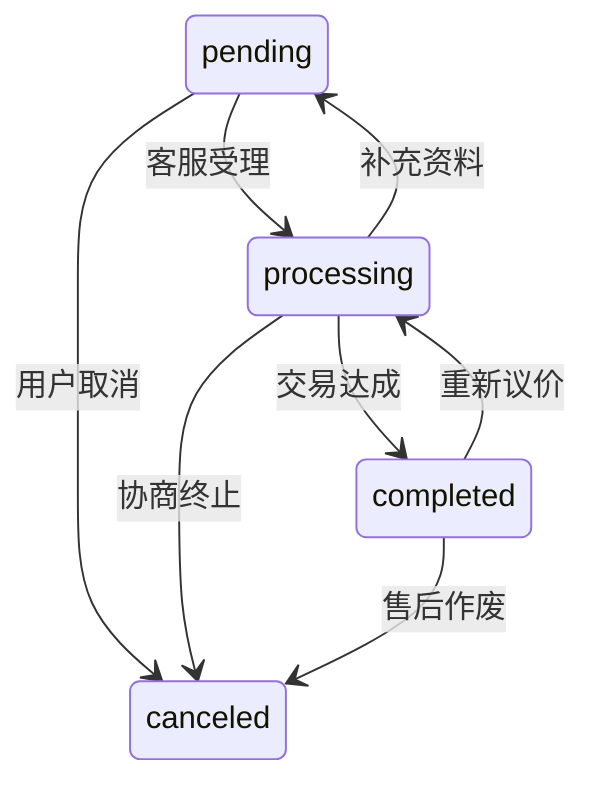

### 回收订单创建接口文档（POST /api/recycle/create）

#### 请求参数调整

| 字段名称        | 类型     | 必填 | 说明                          | 示例值                  |
|----------------|----------|------|------------------------------|-----------------------|
| deviceName     | string   | ✔️   | 设备名称                      | `华为P40 Pro`          |
| deviceModel    | string   | ✔️   | 设备型号                      | `HUAWEI P40 Pro 5G`    |
| deviceInfo     | JSON     | ✔️   | 设备详细信息                  | `{ "内存": "128GB", "颜色": "亮黑色" }` |
| deviceId       | string   | ✔️   | 设备唯一标识（IMEI/SN）       | `IMSI1234567890ABCD`   |
| deviceImage    | string   | ✔️   | 图片Base64编码或URL           | `"data:image/png;base64,xxx..."` |
| deviceVersion  | string   | ✔️   | 设备版本号                    | `V1.0.2`               |
| usageStatus    | enum     | ✔️   | 使用情况（见枚举定义）          | `闲置`                  |
| wearLevel      | number   | ✔️   | 几成新（1-10）                | `8`                    |
| expectedPrice  | number   | ✔️   | 用户期望价格（单位：元）       | `1500.00`              |

#### 请求示例（更新版）

```json
{
  "deviceName": "华为P40 Pro",
  "deviceModel": "HUAWEI P40 Pro 5G",
  "deviceInfo": { "内存": "128GB", "颜色": "亮黑色" },
  "deviceId": "IMSI1234567890ABCD",
  "deviceImage": "data:image/png;base64,xxx...",
  "deviceVersion": "V1.0.2",
  "usageStatus": "闲置",
  "wearLevel": 8,
  "expectedPrice": 1500.00
}
```

#### 成功响应（新增服务端生成ID）

```json
{
  "code": 201,
  "data": {
    "orderId": "SYS_20230825_7X9A2Z",  // 服务端生成的订单编号
    "status": "pending",
    "createTime": "2023-08-25 14:30:00",
    "systemPrice": null
  }
}
```

#### 新增错误类型

```json
{
  "code": 403,
  "message": "订单编号由系统自动生成，请移除orderId字段"
}
```

#### 状态码更新说明

| 状态码 | 变化点                        | 触发场景                      |
|--------|------------------------------|------------------------------|
| 201    | 新增服务端生成orderId         | 成功创建订单                  |
| 403    | 新增错误类型                  | 请求中包含orderId字段时触发   |

---

### 订单编号生成规则

```typescript
// 生成公式：SYS_YYYYMMDD_RANDOM(6位)
const generateOrderId = () => {
  const datePart = dayjs().format('YYYYMMDD')
  const randomPart = Math.random().toString(36).substr(2,6).toUpperCase()
  return `SYS_${datePart}_${randomPart}`
}
```

### 设计优势说明

1. **防重复保障**  
   混合日期+随机字符的方式，在每天10万量级内可保证唯一性（36^6=2,176,782,336种组合）

2. **安全可追溯**  
   通过日期前缀快速定位订单时间段，`SYS`标识区分人工/系统订单

3. **客户端零负担**  
   前端无需集成任何ID生成库，降低客户端复杂度
           |

### 回收订单查询接口文档

#### 1. 查询全部回收订单列表（GET /api/recycle）

##### 请求参数

| 参数名称   | 类型    | 必填 | 说明                          | 示例值   |
|-----------|---------|------|------------------------------|---------|
| page      | integer | ❌   | 当前页码（默认1）             | `1`      |
| pageSize  | integer | ❌   | 每页数量（默认10，最大100）   | `10`     |
| status    | string  | ❌   | 按订单状态过滤               | `pending`|

##### 响应字段

| 字段名称       | 类型    | 说明                          | 示例值               |
|---------------|---------|------------------------------|---------------------|
| total         | integer | 总订单数量                    | `150`               |
| currentPage   | integer | 当前页码                      | `1`                 |
| pageSize      | integer | 每页数量                      | `10`                |
| list          | array   | 订单列表（精简字段）           | [见下方订单对象]     |

订单对象（精简）：

```json
{
  "orderId": "UUID-xxxx-xxxx",
  "deviceName": "华为P40 Pro",
  "expectedPrice": 1500.00,
  "status": "pending",
  "createTime": "2023-08-25 14:30:00"
}
```

##### 响应示例

```json
{
  "code": 200,
  "data": {
    "total": 150,
    "currentPage": 1,
    "pageSize": 10,
    "list": [
      {
        "orderId": "UUID-1234-5678",
        "deviceName": "华为P40 Pro",
        "expectedPrice": 1500.00,
        "status": "pending",
        "createTime": "2023-08-25 14:30:00"
      }
    ]
  }
}
```

#### 2. 查询单个回收订单详情（GET /api/recycle/:id）

##### 请求参数

| 参数名称 | 类型   | 必填 | 说明             | 示例值            |
|---------|--------|------|------------------|------------------|
| id      | string | ✔️   | 订单ID（URL参数）| `UUID-xxxx-xxxx` |

##### 完整响应字段（继承创建接口并补充）

| 新增字段       | 类型    | 说明                          | 示例值               |
|---------------|---------|------------------------------|---------------------|
| status        | string  | 订单状态                      | `pending`           |
| createTime    | string  | 订单创建时间                  | `2023-08-25 14:30:00` |
| finalPrice    | number  | 最终评估价格（单位：元）       | `1450.00`           |

#### 订单状态枚举调整（新增/变更字段）

```diff
| 字段名称       | 类型     | 必填 | 说明                          |
|---------------|----------|------|------------------------------|
| status        | enum     | ✔️   | 订单状态（新三态）            |
| finalPrice    | number   | ✔️   | 最终成交价格（单位：元）      |

# 状态枚举值更新
orderStatus: {
-  "pending": "待评估",
-  "evaluated": "已估价",
-  "completed": "已完成",
-  "canceled": "已取消"
+  "pending": "待处理",
+  "processing": "进行中",
+  "completed": "已结束"
}
```

##### 响应示例

```json
{
  "code": 200,
  "data": {
    "orderId": "UUID-1234-5678",
    "deviceName": "华为P40 Pro",
    "deviceModel": "HUAWEI P40 Pro 5G",
    "deviceInfo": { "内存": "128GB", "颜色": "亮黑色" },
    "deviceId": "IMSI1234567890ABCD",
    "deviceImage": "data:image/png;base64,xxx...",
    "deviceVersion": "V1.0.2",
    "usageStatus": "闲置",
    "wearLevel": 8,
    "expectedPrice": 1500.00,
    "status": "pending",
    "createTime": "2023-08-25 14:30:00",
    "finalPrice": 1450.00
  }
}
```

#### 状态流转示意图



#### 状态码说明

| 状态码 | 说明                     | 解决方案建议               |
|--------|--------------------------|--------------------------|
| 200    | 请求成功                 | -                        |
| 400    | 参数校验失败             | 检查分页参数是否超出限制   |
| 401    | 未授权访问               | 添加有效的身份凭证        |
| 404    | 订单不存在               | 确认订单ID是否正确        |
| 428    | 订单作废                 |
| 500    | 服务器内部错误           | 联系运维人员检查日志       |

#### 3. 订单取消接口（PUT /api/recycle/:id/cancel）

#### 请求参数增强

```diff
{
-  "reasonType": ["用户主动取消", "信息不完整", "价格未达成"],
+  "reasonType": {
+    "USER": ["主动取消", "价格不满意", "信息填写错误"],
+    "ADMIN": ["库存不足", "设备验伪失败", "超时未处理"]
+  },
  "comment": "取消原因说明（10-200字）"
}
```

#### 权限控制矩阵

| 操作主体 | 所需权限                | 允许取消状态          | 备注                      |
|----------|-------------------------|----------------------|--------------------------|
| 普通用户 | X-User-Token            | pending              | 只能操作自己创建的订单    |
| 管理员   | X-Admin-Token + 2FA验证 | pending/processing   | 需填写强制取消审批单号    |

#### 完整接口文档

```http
PUT /api/recycle/SYS_20230825_7X9A2Z/cancel
Content-Type: application/json
X-User-Token: <客户令牌>  # 或 X-Admin-Token: <管理员令牌>

{
  "reasonType": "主动取消",
  "comment": "重新考虑后暂时不需要回收",
  "forceCancelId": "ADM20231123001"  // 仅管理员需要填写
}
```

#### 成功响应（差异化响应）

```json
{
  "code": 200,
  "data": {
    "orderId": "SYS_20230825_7X9A2Z",
    "newStatus": "canceled",
    "operator": "user_12345 / admin_9527",
    "cancelTime": "2023-11-23 14:30:00"
  }
}
```

#### 新增错误类型

```json
{
  "code": 4031,
  "message": "非订单创建者无权操作"
}
{
  "code": 4032,
  "message": "需要二级管理员审批"
}
```

#### 状态码补充说明

| 状态码 | 触发场景                   | 业务规则                     |
|--------|---------------------------|----------------------------|
| 4031   | 用户尝试操作他人订单        | 验证订单创建者与当前用户匹配 |
| 4032   | 高风险取消操作             | 需要另一管理员发送OTP验证码 |
| 409    | 存在关联交易记录            | 必须先撤销支付操作          |

#### 审计日志要求

```typescript
interface CancelLog {
  operatorType: 'user' | 'admin'
  ipAddress: string
  deviceFingerprint: string
  beforeState: OrderStatus
  riskScore: number // 根据操作模式计算风险值
}
```

### 前端实现建议

```javascript
// 用户端取消按钮逻辑
if (order.status === 'pending') {
  showCancelDialog()
} else {
  disableButton('仅待处理状态可取消')
}

// 管理端需增加二次确认
adminCancel() {
  if (riskLevel > 5) {
    require2ndAdminApproval()
  }
}
```
